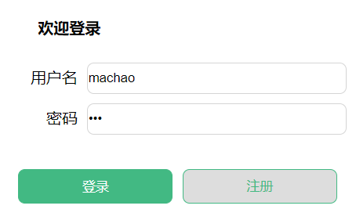
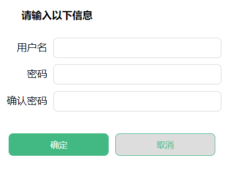
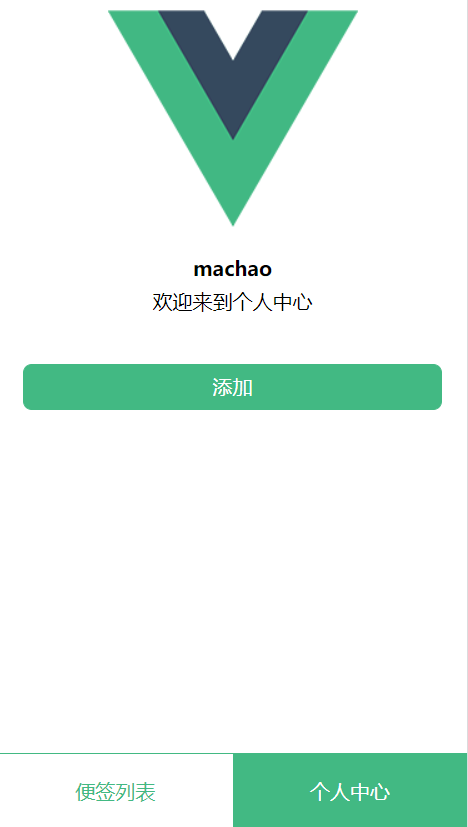
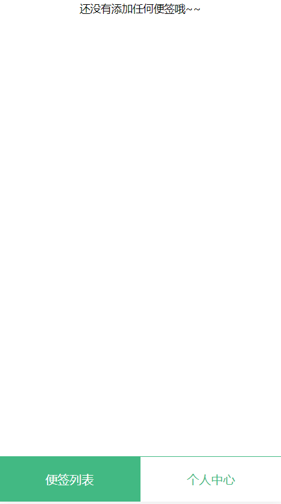
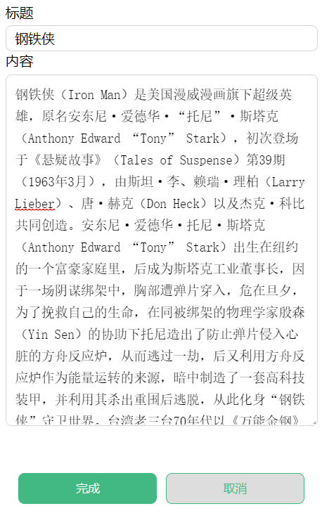
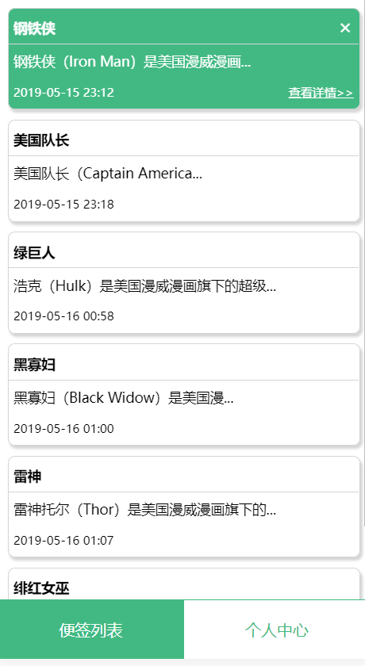

### 应用展示地址 https://mmchao.github.io/note/dist/  
  
### 路由方案：首页(登录页)：'/'  个人中心：'/home/user'   便签列表：'/home/list'  添加页：'/add'   
  
### 页面效果预览：  
1、登录页：  
  
通过isReg的值切换登录和注册的显示，点击注册切换到注册，注册完成后切换到登录   
  
  
2、个人中心/便签列表：  
通过底部的导航按钮切换个人中心和便签列表  
  
    
  
  
3、添加页：  
  
   
4、查看详情：  
通过isDetail的值切换列表页和详情页  
  
    
  
   
5、用户信息和便签列表会保存到本地localStorage，页面重新加载时获取到vuex中，用户登录后用户名保存到sessionStorage,根据用户名筛选便签，从而实现多用户使用。
